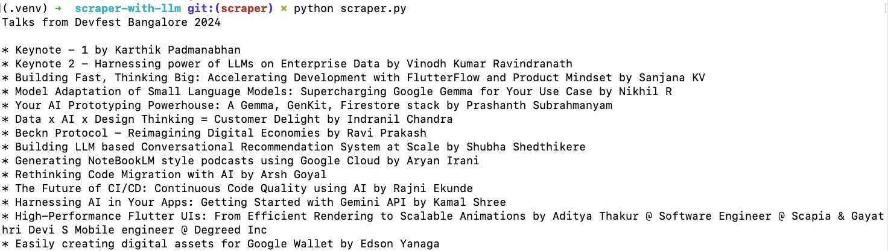
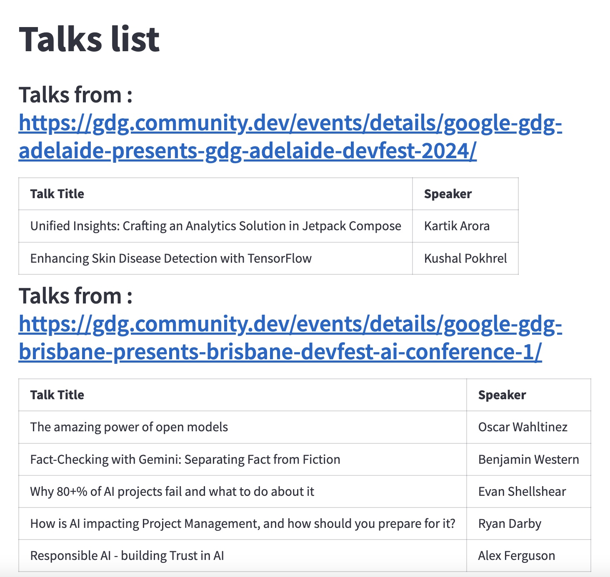
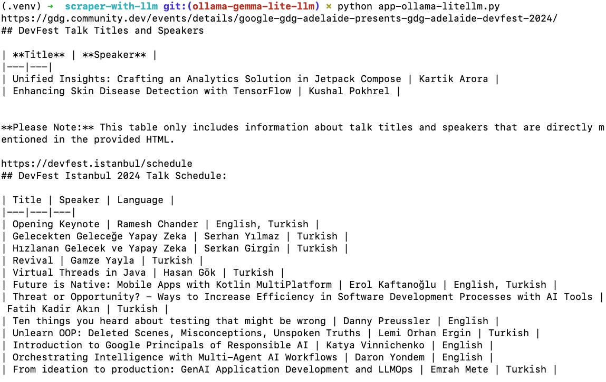

## Scraper with LLM and streamlit

This is a demo project to show how to create a modern-day (LLM-aided) scraper using Beautiful Soup
and Gemini/Gemma to scrape (almost) any website.

For this example, it will scrape talk titles and speakers from 5+ GDG DevFests worldwide.

### This is how it looks

It has multiple steps:

#### Step 1 - Beautiful Soup scraper output

#### Step 2 with Gemini - output with Stremlit

#### Step 3 with Gemmma using LiteLLM - output

## Quick run without Docker (no Streamlit)

To test it out quickly with Python 3 (pip 24.0), you can run the following steps:

1. Clone the repository with `git clone git@github.com:geshan/scraper-with-llm-streamlit.git`
1. Go into the directory `cd scraper-with-llm-streamlit`
1. Install dependencies with `pip install -r requirements.txt`
1. To run the basic scraper, execute `python scraper.py` , you will see the scraped talks and speaker names
1. To run the LLM-aided scraper, first set the Ollama base URL with `export OLLAMA_GEMMA2_9B_BASE_URL=<your-ollama-running-on-cloud-run-url` , details on how to run Ollama on Google Cloud Run is in this [repo](https://github.com/geshan/ollama-cloud-run)
1. Then run `python app-ollama-litellm.py`, it will take a bit of time, and then you will see the talks and speaker names

This has been tried on Google Cloud Console, and it worked.     
